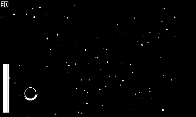
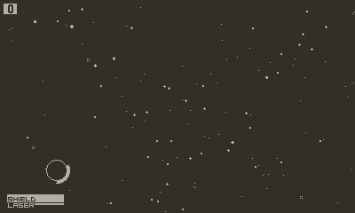
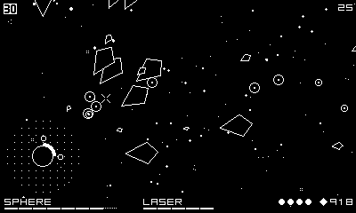
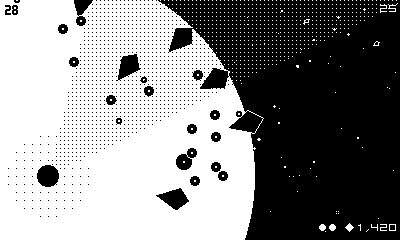

# Laser Sphere Post-mortem

While working on larger, more traditional 8-bit style games (like Season One's [Ratcheteer][ratcheteer] and my upcoming, still untitled RPG) I frequently prototype random, smaller mechanics. Sometimes (most times) those ideas go nowhere, but others, something clicks and I come out the other end with a finished game. Like [Word Trip][word-trip]. And yesterday's drop, [Laser Sphere][laser-sphere].

[ratcheteer]: https://play.date/games/ratcheteer/
[word-trip]: https://play.date/games/word-trip/
[laser-sphere]: https://play.date/games/laser-sphere/

## Unlikely Inspiration
	
I think I've probably played Tears of the Kingdom every day since it came out. First beating it with the kids, then playing through it again on my own. Then doing random challenge runs with constraints (usually determined by the 4 and 8 year old). And I'm still doing them. Right now it's a Shrine-acquired-only run. One of my least favorite mechanics in the game (and its predecessor) is the stamina wheel. All my upgrades go to stamina to neutralize the annoyance. 

So what does all this have to do with a game about controlling a space laser with a crank? When I don't like a mechanic I try to understand why and think about ways to make it fun. I find I have trouble not jumping straight to production at the first hint of an interesting idea so I've been making a more concerted effort to start simple. An empty, star-filled sky is pretty simple. The player is a stationary filled circle. Might be a planet or maybe a Dyson sphere. Asteroids or kamikaze ships on a collision course from all directions. Naturally we need a BF laser beam to ward them off and using one-to-one crank input for sweeping it across the sky just makes sense. Training it on a fast approaching target takes some dexterity but being able to fire continuously indefinitely eliminates some of the need for precision. Re-enter the stamina wheel.

The laser will overheat if fired for too long, forcing breaks and adding an urgency to acquiring your target. But if it does overheat, what to do in the downtime? Well, these ships obviously leave behind scrap that can be salvaged. So we need a tractor beam. All this scrap clutters up the playfield, masking incoming threats and encouraging the player to balance laser-ing and tractor-ing to stay on top of the action.

## Upgrades

The earliest prototypes had the sphere centered on screen. This was fine for a quick proof of concept but difficulty didn't scale well. Threats approaching from the top and bottom of the screen had less distance to travel than those approaching from the left and right and threats approaching from opposite directions at the same time were almost impossible to cope with. Both issues left the player with limited-to-no time to react. So the first revision moved the sphere to a corner, with the first few waves of enemies approaching from the opposite corner. With each wave the aperature of the angle of attack expands a few degrees from 50° to 110°.

Initially the scrap that enemies drop just repaired the shield but that quickly transformed into a currency for upgrading the sphere. Or more specifically its systems. As the screen filled with more and more threats, the fixed, limited laser time became a problem. Extending it to make later waves manageable made earlier ones trivial and increased cooldown time. Increasing the shield strength created similar issues. So the first upgrades were permanent buffs to shield durability, laser duration, and recharge speed to better manage the increasing angle and frequency of enemy attacks. Consumables like shield repair and screen clearing bomb quickly followed. As the swarms grew in number and speed with each wave, the Orbital Drones and Gravity Well allowed the focus of the player to shift to the next most prominent threat. The Quantum Core added continues and the Laser Doubler adds a high risk, high reward challenge to the late game (and might be the only way to survive the post-game waves).

## Routing an Evolving Challenge

There are four types of ships in Laser Sphere. Each bigger, slower, and more durable than the last. The quantity and speed of each class increases with each wave producing a gradual, constant increase in difficulty. In the early game focus falls on quickly sweeping up tiny fast moving ships and training the laser on the occasional small ship. A rare large, slower moving ship takes even longer to bring down. As the player adds Shield Emitters or the first Orbital Drone they can start to ignore the gnats to focus on the increasing number of small and large ships. A second Orbital Drone relegates the small ships to gnat status allowing the player to focus on the increasingly aggressive large ships and more frequent huge ships. In the late and post-game the player needs to commit to either the risky Laser Doubler or start depending on Stellar Bombs just to keep their head above water.

A novice can invest in Shield Emitters to improve their durability and Stellar Bombs to recover from an overheated laser while someone more confident in their ability can forgoe incremental buffs and prioritize Power Cells before making a bee line to both Orbital Drones and the Laser Doubler. All players should probably invest in Quantum Cores as soon as possible since the price increases at regular wave intervals.

## Sound Design

Once the core systems were mostly dialed in I put the game down for a month or so until one day I was inspired to write some music. Rather than having a static background track I wanted to try something more dynamic, I wanted the music to increase in intensity with the onscreen action. So I wrote a dark, layered track of full of drones with piercing melody and harmony, and evolving percussion. Each layer was exported separately and is faded in and out depending on the presence, quantity, and proximity of each class of ship. Ambient drones indicate the presence, more melodic lines come in when they appear in numbers, and the crashes come in when they get too close to the sphere. You can hear the approach of certain classes of ships before they appear onscreen. An urgent twinkle plays over the drone of empty space on the upgrade screen. I somehow managed to capture the sound I was looking for right out of the gate.

A month or so later fellow Panic coworker Mike Freuden volunteered to write some additional music for the game. A few days later he dropped the title screen music, nailing that '80s space-y sci-fi soundtrack vibe I was going for. We talked about one thing I love about games from the 8 and 16-bit generationsm, the limited and uniform palette within each game, both in terms of visuals and audio. So we decided to cross-polinate the instruments used in game and the title screen music to unify the sound.

## Playtesting

While we playtest internally over the course of development, it's always a good idea to get some fresh eyes on the game as you get closer to the finish line. I was definitely difficulty blind by this point and the folks at Panic were well versed in how things were supposed to work, having been along for the ride from the start. Fortunately Mark LaCroix reaches out to the community every month, inviting Playdate developers to put their games in front of real live humans at Twin Cities Playtest. The event is even streamed and archived on YouTube. 

After seeing a few people struggle to get a run going it was pretty clear that some in-game explanation of the laser mechanic was necessary. So I added a short tutorial before you play the first wave for the first time. Rather than just explaining the mechanic, the player is forced to overheat the laser, wait through the cooldown, then asked to fire three times without overheating. I also decided to show a random tip every time the Quantum Core activates to guide struggling players to more effective strategies.

## Optimizing

I was kind of surprised Laser Sphere performs as well as it does on the hardware as there's a lot of non-trivial math and geometry rendering. But it was getting bogged down on later waves, especially in the post-game. Before moving some of the heavier visual effects from Lua to C I was able to regain 6-8ms per frame by reducing the amount of matrix math and affine transform manipulation in loops. I may have also saved some more by further minimizing update loop table generation and reducing garbage pressure but that's harder to measure. 

I moved drawing the parallax starfield background and fullscreen "burning cosmos" effect to C. The combined clear then drawing opaque "background" stars and semi-opaque "foreground" stars took 5-6ms every frame in Lua. I converted both images into arrays of coordinates then directly updated the framebuffer with a memset and bitshifting only the white pixels which got it down to 0ms per frame. This is a nice saving throughout but only really felt in latter parts of the game.

I tried optimizing the fullscreen effect in Lua first, changing from using a stencil to clip rects and got it down from 5-6ms to 3-4ms per frame. Moving that to C (same logic, just closer to the metal) got it down to 1-2ms per frame. I might be able to squeeze more out of that by directly updating the framebuffer but I doubt anything I could muster would perform better than the SDK blitting functions.

## The End? (Spoilers)

Every four waves the quantity, distribution, and speed of the enemy ships increases. The first "ending" happens after the twentieth wave with an additional one occuring every four waves until the killscreen on wave thirty-two. The endings are nonsense, with conflicting narratives about setting the cosmos ablaze and the heat death of the universe, largely there just to justify the visual (and aural) effect of the waves that follow.

## A Brief Timeline

Thanks for reading this far. And thanks for playing. I'll wrap up with an illustrated timeline of the project gleened from interal Slack messages.

-- First mention and gameplay gif, August 3, 2023

-- Added tractor beam and shared prototype, August 4, 2023

 

-- New prototype with bombs and "shop", August 15, 2023

-- First music demo, September 11, 2023

-- Background audio implmentation, September 13, 2023

-- New power drain UI, September 28, 2023

-- Title screen music, sound effects, final upgrades added, October 6, 2023

-- Final sound effects, optimization, October 13, 2023

-- Added tips and tutorial, October 19, 2023

-- Catalog Drop trailer, February 27, 2024